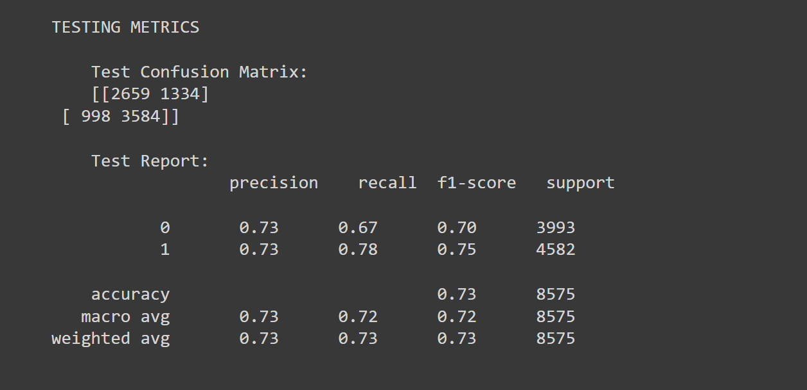

Neural Network model Report

Overview:
The purpose of this exercise is to aid the nonprofit foundation Alphabet Soup by creating a machine learning tool that can successfully predict whether or not an organization will be successful if they receive funding.

Results:

Data Preprocessing

    -What variable(s) are the target(s) for your model?
    My Target for the model is the "IS_SUCCESSFUL" column.

    -What variable(s) are the features for your model?
    The features are the "STATUS","ASK_AMT","APPLICATION_TYPE","AFFILIATION","CLASSIFICATION","USE_CASE","ORGANIZATION","INCOME_AMT",and "SPECIAL_CONSIDERATIONS" columns.

    -What variable(s) should be removed from the input data because they are neither targets nor features?
    I removed the "EIN" and "NAME" columns due to them contributing very little to the overall equation or outcome.

Compiling, Training, and Evaluating the Model

    -How many neurons, layers, and activation functions did you select for your neural network model, and why?
    For the first model I used a total of 8, spread across 3 layers, with functions "relu", and "sigmoid" in an attempt to keep things simple for my first assignment while still keeping a moderate chance of success in reach. 

    -Were you able to achieve the target model performance?
    After running 4 models, I was able to achieve an accuracy rating of about 73%.

    -What steps did you take in your attempts to increase model performance?
    After my first model, I increased the 2nd model's neurons up to 28, the layers to 4, but kept the functions and epochs the same. For the last model, I made a total of 86 neurons spread across 6 layers with the same functions and epochs. After seeing the models only fractionally improve in accuracy, I decided to halt further attempts. 

Summary: Overall, the final model exhibited an accuracy rating of 73%, a roc curve of 0.782, and 2659 true positive guesses. While the overall guesses were somewhat decent, there is still plenty of room for improvement with 1334 and 998 incorrect answers. Given more time, I would experiment with a random forest model, as it has shown great promise thanks to it's random properties that results in a wider diversity of training and thus, better predictions for challenges such as this one. 

Final results of model #4:
